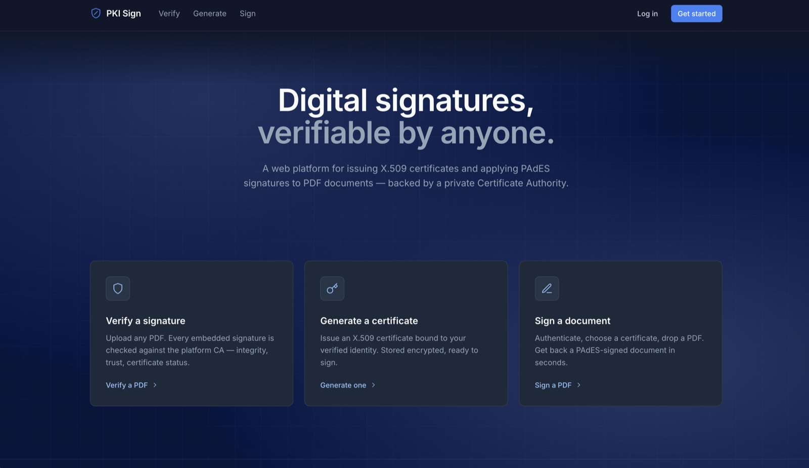
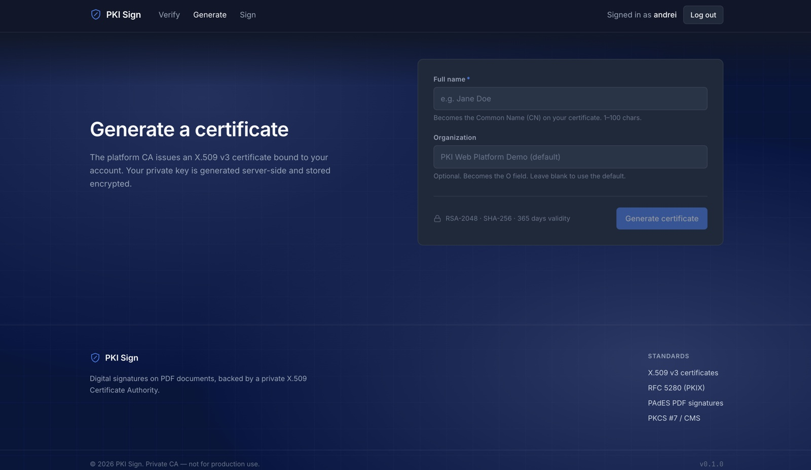
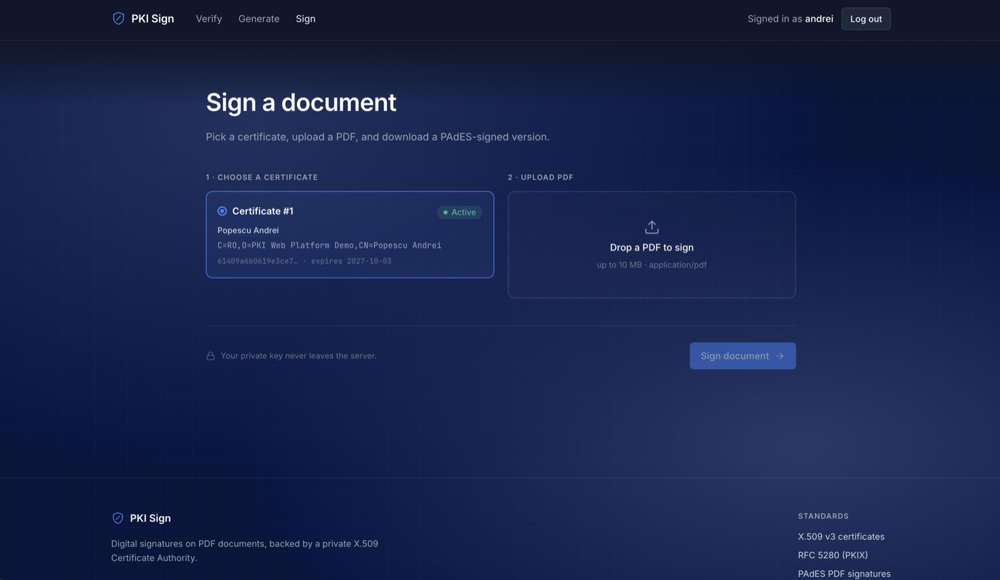
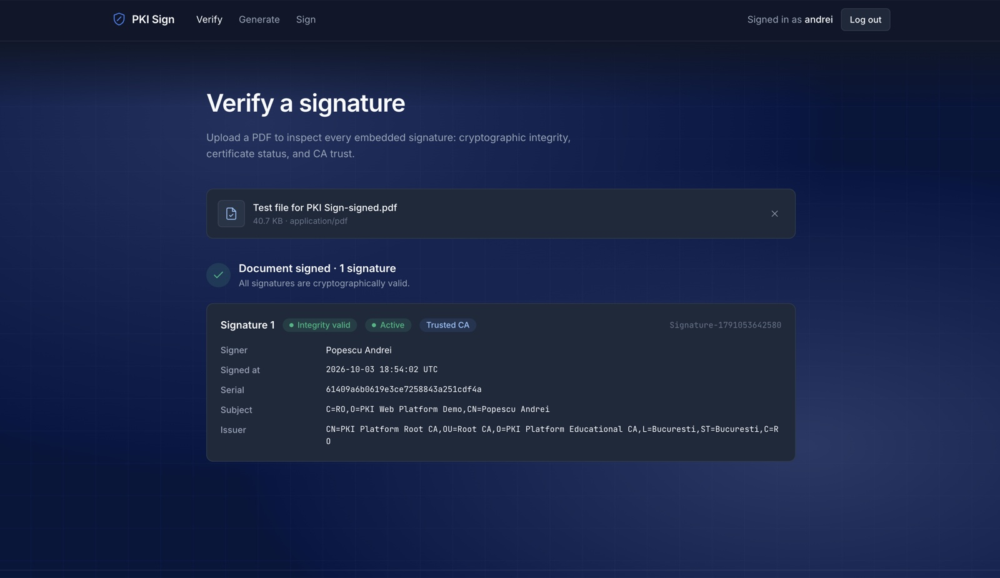
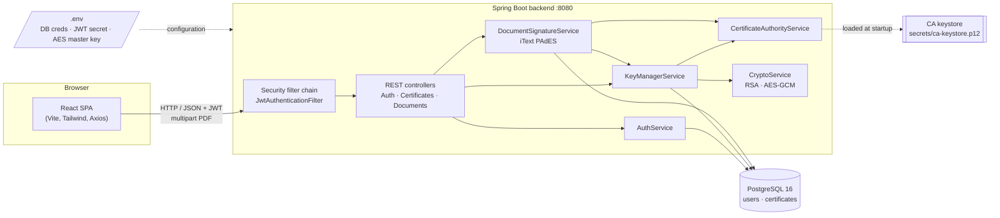
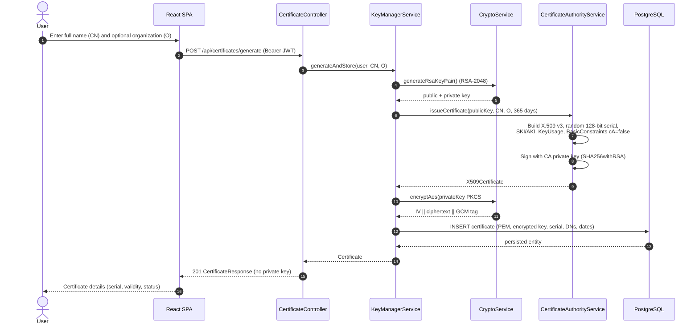
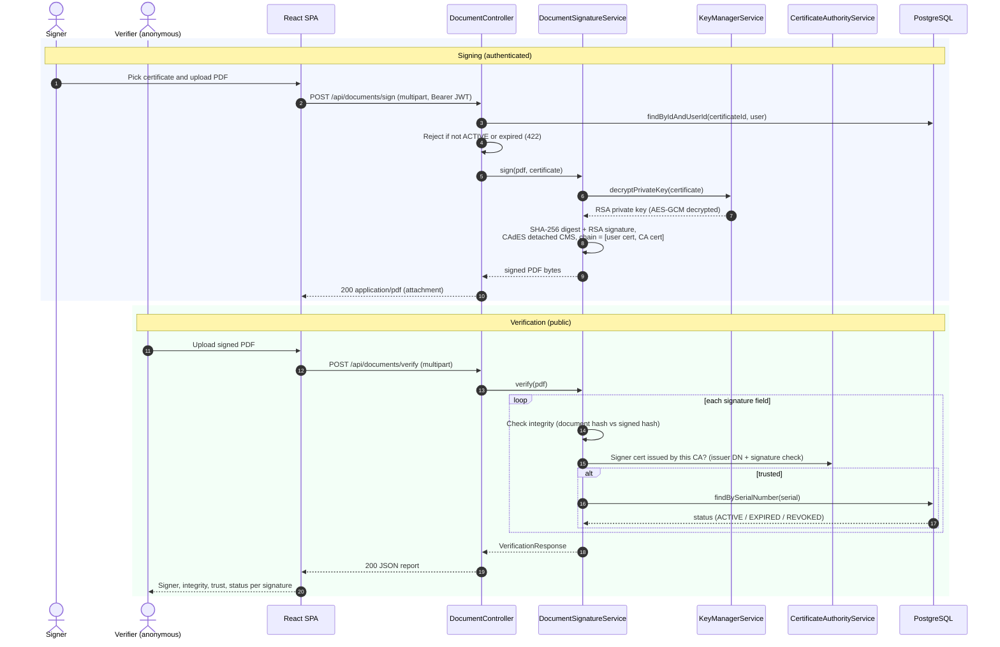
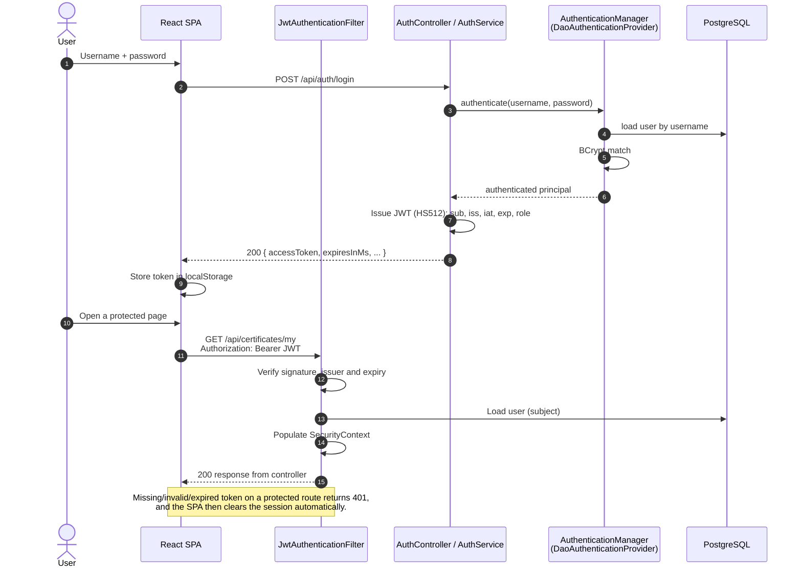
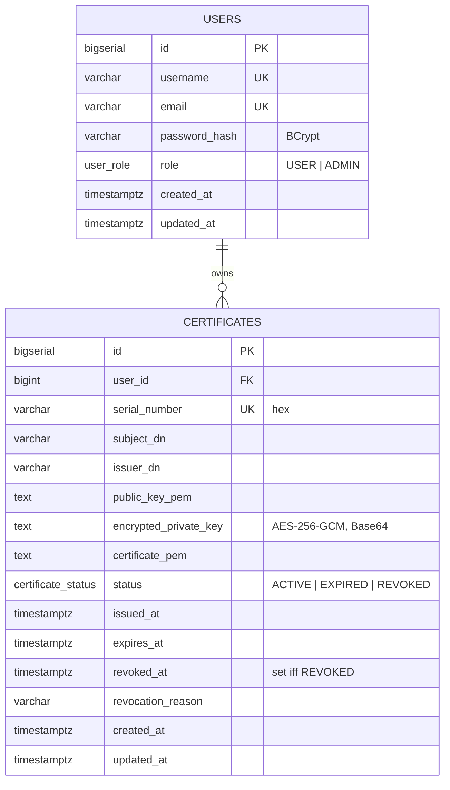

# PKI Web Platform

[](https://github.com/andreiii04/pki-web-platform/actions/workflows/ci.yml)


A full-stack web application that runs its own **private Certificate Authority**: users register, get an
**X.509 v3 certificate** issued for a freshly generated RSA key pair, **sign PDF documents** with it
(PAdES-compatible CMS signatures) and let **anyone verify** a signed PDF: integrity, signer identity,
trust in the issuing CA and current certificate status.

> **Academic project.** Built as a university project for the *Internet Programming Technologies* course
> (*Tehnologii de Programare în Internet*). The cryptography is real (RSA, SHA-256, AES-GCM, X.509),
> but the CA is private and unaccredited, so signatures have no legal value. The goal is to demonstrate
> how a PKI works end to end.

---

## Table of contents

- [Features](#features)
- [Screenshots](#screenshots)
- [Architecture](#architecture)
- [Cryptographic design](#cryptographic-design)
- [Tech stack](#tech-stack)
- [Project structure](#project-structure)
- [Getting started](#getting-started)
- [Environment variables](#environment-variables)
- [API overview](#api-overview)
- [Testing](#testing)
- [Security considerations](#security-considerations)
- [Limitations and roadmap](#limitations-and-roadmap)
- [License](#license)

---

## Features

- **Private Root CA**: a self-signed RSA-4096 root created with OpenSSL (`scripts/generate-ca.sh`),
  stored in a password-protected PKCS#12 keystore and loaded by the backend at startup.
- **Key generation and certificate issuance**: per-user RSA-2048 key pairs and X.509 v3 end-entity
  certificates signed by the CA (SHA256withRSA, 128-bit random serials, SKI/AKI, critical `KeyUsage`
  and `BasicConstraints`).
- **Encrypted key storage**: users' private keys are encrypted with **AES-256-GCM** under a master key
  before they reach the database; they never leave the server in plaintext.
- **PDF signing**: PAdES-compatible detached CMS (CAdES) signatures via iText 9, embedding the
  user certificate and the CA certificate.
- **Public PDF verification**: for each signature in a document, it reports integrity, signer CN/DN,
  signing time, whether the signer certificate was **cryptographically issued by this CA**, and the
  certificate status (`ACTIVE` / `EXPIRED` / `REVOKED`).
- **Stateless JWT authentication**: registration and login with BCrypt-hashed passwords and HMAC-SHA512
  signed tokens.
- **Consistent error model**: every API error returns the same JSON shape (see [API overview](#api-overview)).
- **Interactive API docs**: OpenAPI 3 / Swagger UI with a JWT "Authorize" button.
- **React SPA**: Verify, Generate and Sign flows with drag-and-drop upload and automatic logout when the API rejects the token.

## Screenshots

| Home | Generate a certificate |
|---|---|
|  |  |
| **Sign a document** | **Verify a signature** |
|  |  |

## Architecture

### System overview



### Certificate issuance



### PDF signing and verification



### Authentication (JWT)



### Data model



The schema is managed by **Flyway** (`backend/src/main/resources/db/migration`); Hibernate only validates it.
Native PostgreSQL enums back the `role` and `status` columns, and a `CHECK` constraint keeps `status = REVOKED`
and `revoked_at IS NOT NULL` consistent.

## Cryptographic design

| Concern | Choice | Rationale |
|---|---|---|
| Root CA key | RSA-4096, self-signed, 10-year validity, `CA:TRUE`, `keyCertSign` + `cRLSign` | Long-lived trust anchor; larger key for the most valuable secret. |
| User keys | RSA-2048 (configurable 2048–4096) | NIST SP 800-57 minimum for current use; fast to generate on demand. |
| Certificate signature | SHA256withRSA (configurable within SHA-2 family; SHA-1 rejected by config validation) | Widely supported by PDF readers. |
| End-entity profile | X.509 v3, 128-bit random serial, SKI/AKI, `KeyUsage` = digitalSignature + nonRepudiation (critical), `BasicConstraints cA=false` (critical), EKU emailProtection, 365-day validity | Restricts user certificates to signing; a leaked user key cannot mint certificates. |
| Private key at rest | AES-256-GCM, 96-bit random IV per encryption, 128-bit tag; stored as `Base64(IV ‖ ciphertext ‖ tag)` | Authenticated encryption: tampering or a wrong key is detected on decryption. |
| Document signature | PAdES-compatible detached CMS (CAdES subfilter), SHA-256 digest, chain = user cert + CA cert | Standard format readable by Adobe Acrobat and other validators. |
| Trust decision on verify | Signer certificate must name this CA as issuer **and** its signature must verify with the CA public key | Matching names alone could be spoofed by a look-alike CA. |
| Passwords | BCrypt (strength 10) | Adaptive, salted password hashing. |
| API tokens | JWT, HMAC-SHA512 (key ≥ 64 bytes), `iss` and `exp` enforced | Stateless auth; the algorithm is derived from the key length by JJWT. |
| Provider | Bouncy Castle 1.84 registered as a JCA provider | Consistent algorithms across JDKs; X.509 builders (bcpkix). |

## Tech stack

| Layer | Technologies |
|---|---|
| Backend | Java 21, Spring Boot 3.5 (Web, Security, Data JPA, Validation), Flyway, JJWT 0.13, Bouncy Castle 1.84, iText 9.4, springdoc-openapi 2.7 |
| Frontend | React 18, Vite 5, Tailwind CSS 3, React Router 6, Axios, ESLint 9 |
| Database | PostgreSQL 16 (Docker Compose) |
| Tooling | Maven Wrapper, OpenSSL 3 (CA generation), GitHub Actions CI |

## Project structure

```
.
├── backend/                          Spring Boot REST API
│   ├── src/main/java/ro/etti/pki/platform/
│   │   ├── config/                   JPA auditing, OpenAPI, typed @ConfigurationProperties
│   │   ├── controller/               Auth, Certificate and Document REST endpoints
│   │   ├── dto/                      Request/response records
│   │   ├── entity/                   JPA entities (User, Certificate) and enums
│   │   ├── exception/                Domain exceptions + GlobalExceptionHandler
│   │   ├── repository/               Spring Data repositories
│   │   ├── security/                 Security config, JWT filter/service, entry point
│   │   └── service/                  Auth, key management, CA, crypto, PDF signing
│   ├── src/main/resources/
│   │   ├── application.yml           Configuration (dev/prod profiles)
│   │   └── db/migration/             Flyway migrations
│   └── src/test/java/                Unit tests (crypto, CA, signing) + context test
├── frontend/                         React SPA
│   └── src/
│       ├── api/                      Axios instance with JWT interceptor
│       ├── components/               UI building blocks (modal, dropzone, navbar, ...)
│       ├── context/                  Auth context (token + user state)
│       ├── pages/                    Home, Verify, Generate, Sign
│       └── utils/                    Formatting helpers
├── docker/docker-compose.yml         PostgreSQL service
├── scripts/generate-ca.sh            Root CA generation (OpenSSL 3)
├── .github/workflows/ci.yml          Backend build/tests + frontend lint/build
├── .env.example                      Environment variable template
└── secrets/                          CA key material (generated locally, git-ignored)
```

## Getting started

### Prerequisites

- **Java 21** (e.g. Temurin; `.sdkmanrc` is provided for SDKMAN users)
- **Node.js 20+** and npm
- **Docker** with Docker Compose v2
- **OpenSSL 3** (macOS: `brew install openssl@3`; the system LibreSSL is not sufficient)

### 1. Configure the environment

```bash
cp .env.example .env
```

Fill in `.env`. At minimum, generate the secrets:

```bash
openssl rand -base64 64 | tr -d '\n'   # JWT_SECRET
openssl rand -base64 32                # AES_MASTER_KEY
```

and choose values for `POSTGRES_PASSWORD` and `CA_KEYSTORE_PASSWORD`.

### 2. Generate the Root CA (once)

```bash
./scripts/generate-ca.sh
```

Enter the same password you set as `CA_KEYSTORE_PASSWORD` in `.env`. The key, certificate and PKCS#12 bundle
are written to `secrets/`, which is git-ignored.

### 3. Start PostgreSQL

```bash
docker compose --env-file .env -f docker/docker-compose.yml up -d
```

### 4. Run the backend

```bash
cd backend
./mvnw spring-boot:run
```

The API starts on `http://localhost:8080` and reads `.env` automatically. Flyway creates the schema on first run.

### 5. Run the frontend

```bash
cd frontend
npm ci
npm run dev
```

Open `http://localhost:5173`: register, generate a certificate, sign a PDF, then verify it (no login needed).

## Environment variables

| Variable | Required | Default | Description |
|---|---|---|---|
| `SPRING_PROFILES_ACTIVE` | no | `dev` | `dev` (verbose logging) or `prod` (minimal error details) |
| `POSTGRES_DB` | yes | – | Database name (also used by Docker Compose) |
| `POSTGRES_USER` | yes | – | Database user |
| `POSTGRES_PASSWORD` | yes | – | Database password |
| `POSTGRES_HOST` | no | `localhost` | Database host |
| `POSTGRES_PORT` | no | `5432` | Database port |
| `CA_KEYSTORE_PATH` | yes | – | Path to the CA PKCS#12 keystore, relative to the repository root (`./secrets/ca-keystore.p12`) |
| `CA_KEYSTORE_PASSWORD` | yes | – | Keystore password chosen in `generate-ca.sh` |
| `CA_KEY_ALIAS` | yes | – | Keystore alias (`pki-root-ca`) |
| `JWT_SECRET` | yes | – | Base64 HMAC key, at least 32 bytes decoded (64 recommended for HS512) |
| `JWT_EXPIRATION_MS` | no | `3600000` | Token lifetime in milliseconds |
| `AES_MASTER_KEY` | yes | – | Base64 key that decodes to exactly 32 bytes (AES-256) |
| `SERVER_PORT` | no | `8080` | HTTP port of the backend |

All values are bound through typed `@ConfigurationProperties` classes with Bean Validation, so a missing or
malformed value stops the application at startup with a clear message. Real environment variables take
precedence over `.env`.

## API overview

Interactive documentation: **http://localhost:8080/swagger-ui.html** (OpenAPI JSON at `/v3/api-docs`).
Use **Authorize** with the `accessToken` returned by login to call protected endpoints.

| Method | Path | Auth | Description | Success |
|---|---|---|---|---|
| `POST` | `/api/auth/register` | public | Create an account (auto-login) | `201` `AuthResponse` |
| `POST` | `/api/auth/login` | public | Obtain a JWT | `200` `AuthResponse` |
| `POST` | `/api/certificates/generate` | JWT | Issue an X.509 certificate for the caller | `201` `CertificateResponse` |
| `GET` | `/api/certificates/my` | JWT | List the caller's certificates | `200` `CertificateResponse[]` |
| `POST` | `/api/documents/sign` | JWT | Sign a PDF (`multipart`: `file`, `certificateId`, optional `reason`, `location`) | `200` `application/pdf` |
| `POST` | `/api/documents/verify` | public | Verify all signatures in a PDF (`multipart`: `file`) | `200` `VerificationResponse` |

Uploads are limited to 10 MB. Errors share one format:

```json
{
  "timestamp": "2026-01-01T12:00:00Z",
  "status": 422,
  "error": "Unprocessable Entity",
  "message": "Certificate is not usable (status=REVOKED)",
  "path": "/api/documents/sign",
  "fieldErrors": { "commonName": "must not be blank" }
}
```

`fieldErrors` is present only on validation failures (`400`).

## Testing

```bash
# Backend: unit tests + Spring context test (needs PostgreSQL and the CA from steps 1–3)
cd backend && ./mvnw verify

# Backend: unit tests only (no database required)
cd backend && ./mvnw test -Dtest='!PkiPlatformApplicationTests'

# Frontend: lint + production build
cd frontend && npm run lint && npm run build
```

Unit tests cover AES-GCM round-trips and tamper detection, RSA signatures, X.509 issuance (extensions, validity,
chaining to the CA), PEM round-trips, PDF sign → verify, and rejection of certificates from a look-alike CA.
CI runs the full suite against a PostgreSQL container with a freshly generated CA and throwaway secrets.

## Security considerations

- **Custodial keys.** Key pairs are generated and stored server-side (encrypted). This keeps the demo simple but
  means the server can sign on a user's behalf; a production PKI would accept a CSR or use a hardware token.
- **Master key and CA key handling.** The AES master key comes from the environment and the CA key from a file
  keystore. Production deployments should use a KMS/HSM and key rotation.
- **Token storage.** The SPA keeps the JWT in `localStorage`, which is exposed to XSS. HttpOnly cookies with
  CSRF protection would be safer for production.
- **No revocation distribution.** Certificate status is checked against this platform's database only; there is
  no CRL or OCSP endpoint, and signatures carry no trusted timestamp (PAdES B-B level).
- **CORS** allows only `http://localhost:5173`; there is no rate limiting on the login endpoint.
- **Secrets** live only in `.env` and `secrets/`, both git-ignored. Never commit them.

## Limitations and roadmap

- [ ] Certificate revocation endpoint (`POST /api/certificates/{id}/revoke`) and UI; the schema already supports it
- [ ] CRL / OCSP publication for third-party validators
- [ ] RFC 3161 timestamps (PAdES B-T) and long-term validation data (B-LT)
- [ ] Admin features for the existing `ADMIN` role (user and certificate management)
- [ ] CSR-based issuance / client-side key generation, and PKCS#12 export
- [ ] Containerised backend and frontend for a one-command `docker compose up`
- [ ] Testcontainers for the Spring context test

## License

Released under the [MIT License](LICENSE).
